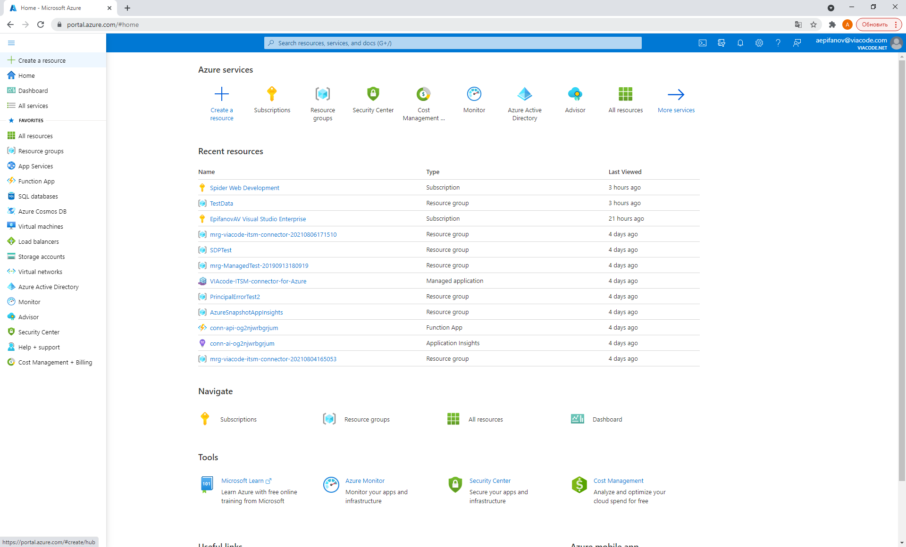
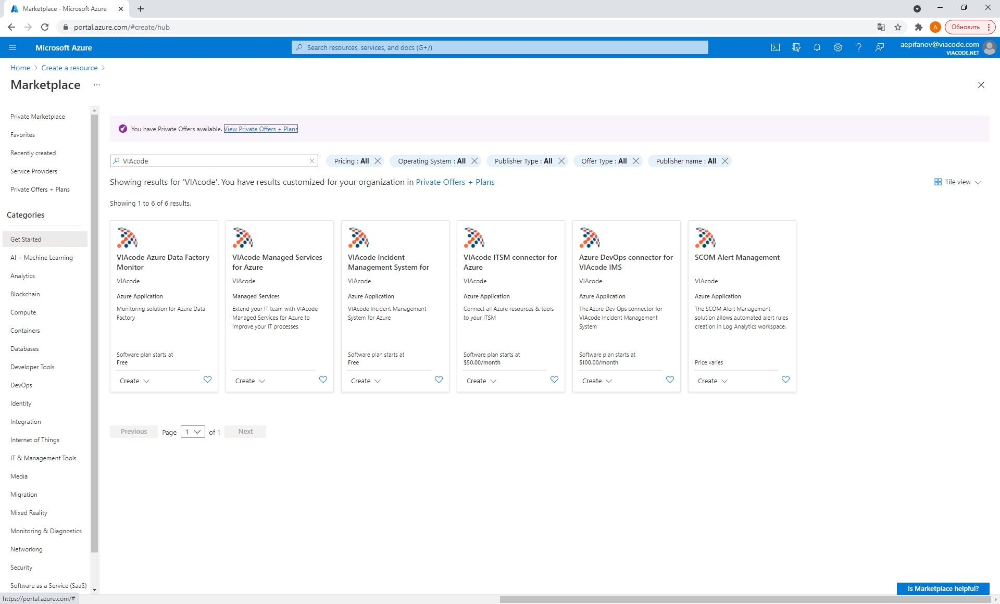
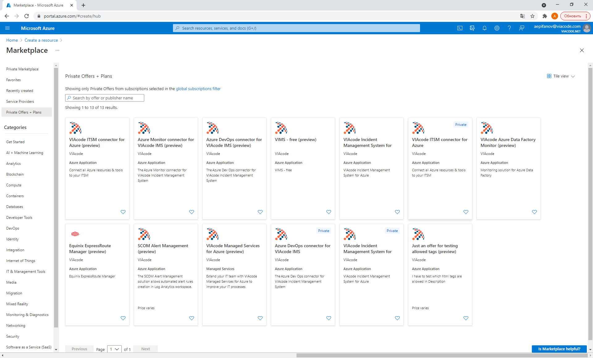
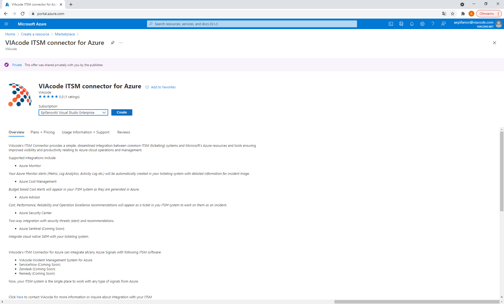

# VIAcode ITSM connector for Azure for ServiceDesk Plus MSP deployment and configuration guide
This guide is based on version **1.0** of VIAcode ITSM Connector for Azure for **ServiceDesk Plus MSP**.

<!-- TOC -->

- [Before you begin](#before-you-begin)
  - [Deploy](#deploy)
    - [VIAcode Managed Service customers](#viacode-managed-service-customers)
    - [Not VIAcode Managed Service customers](#not-viacode-managed-service-customers)
    - [Pricing](#pricing)

- [Configuration of VIAcode ITSM connector for Azure](#configuration-of-viacode-itsm-connector-for-azure)
  - [Basics](#basics)
  - [ServiceDesk Plus MSP (for VIAcode Managed Service customers)](#servicedesk-plus-msp-for-viacode-managed-service-customers)
  - [Review and create](#review-and-create)
- [Alert state backward synchronization](#alert-state-backward-synchronization)
    - [Overview](#overview)
    - [How to setup](#how-to-setup)
- [Uninstallation of VIAcode ITSM connector for Azure](#uninstallation-of-viacode-itsm-connector-for-azure)
  - [Deletion Notes](#deletion-notes)
  - [Steps to Remove Application and Managed Resource Group](#steps-to-remove-application-and-managed-resource-group)  
  
- [Technical details](#technical-details)
  - [Supported alert types](#supported-alert-types)
- [How-to guide](#how-to-guide)
<!-- TOC END -->

## Before you begin

Verify that your account user type is not Guest in the chosen tenant.

- Sign in to the [Azure Portal](https://portal.azure.com/).
- Select "Azure Active Directory", select "Users".

[Guest](https://docs.microsoft.com/azure/active-directory/b2b/user-properties) accounts have limited permissions. Deployment under a guest account will fail.

## Upgradability

Please note, to use new version of connector previous version must be uninstalled first. After connector re-installation prior opened tickets will be synced and updated with new connector automatically.

## Deploy

### VIAcode Managed Service customers

<u>If you are a VIAcode Managed Service customer</u> then to install VIAcode ITSM connector for Azure open Azure Portal and click Create a resource.

Type VIAcode in a "Search services and marketplace" box and press Enter.

---
**NOTE**

Do not select VIAcode ITSM connector for Azure from dropdown.

---

You will see panel with text "You have Private Offers available" and "View Private Offers + Plans" hyperlink besides.
Click on it.

Find VIAcode ITSM connector for Azure and click on it.

Select subscription to install connector to and click Create.

### Not VIAcode Managed Service customers

- [Navigate](https://azuremarketplace.microsoft.com/en-us/marketplace/apps/viacode_consulting-1089577.viacode-itsm-connector-for-azure) to Microsoft Azure Marketplace and find "VIAcode ITSM connector for Azure" offer.

- Press "Get it now" button.
- Press "Continue".

You will be taken to Azure Portal to complete installation:

- Press "Create".

### Pricing

The total cost of running VIAcode ITSM connector for Azure is a combination of the selected software plan and cost of the Azure infrastructure on which you will be running it. The Azure infrastructure cost might vary with regards to the region, type of subscription and other discounts.

## Configuration of VIAcode ITSM connector for Azure

### Basics

- Choose a subscription to deploy the managed application.
- Create a new Resource Group.
- Select a region.
- Provide a name for your application's managed resource group.
- Press "Next : Settings >" button.

### ServiceDesk Plus MSP (for VIAcode Managed Service customers)

Ask us for <u>ServiceDesk Plus MSP API Key</u> and <u>Account name</u>.

- Enter API Key.
- Enter Account name.
- Press "Next : Review + create >" button.

### Review and create

- Agree to the terms and conditions.
- Press "Create" button.

## Alert state backward synchronization

### Overview

VIAcode ITSM connector for Azure provides an alert state backward synchronization mechanism. It enables automatic state synchronization of the ITSM system requests and Azure Alerts.

### How to setup

In order to configure alert state synchronization please provide VIAcode ITSM connector for Azure Managed App with **Contributor** Role for the subscription where connector installed.

- Click on the installed managed application.
- Select 'Application Permissions (preview)' blade.

- Click "Add."

  - Select 'Contributor' role.
  - Check that Connector's subscription is selected.
  - "OK."

## Uninstallation of connector 

### Deletion notes
Installation of connector requires 2 resource groups:

- The first one for the application itself (Managed Application location).
- The second is for the managed resources that the application requires (e.g. "mrg-viacode-itsm-z-`<id>`").

### Steps to Remove Application and Managed Resource Group
**Step 1:**
Go to Resource Group where the Managed Application installed (application name is "VIAcode-ITSM-connector-for-Azure").

**Step 2:**
Select this Application and click "Delete" button, confirm the deletion by typing "Yes" on the sidebar, then click "Delete".
Deletion the Managed Application will consequently delete the second resource group with "mrg-" prefix and all of its content.

**Step 3:** (optional)
If the First Resource Group is empty - only Managed Application was stored there - you should also delete this Resource Group as well.

## How-to guide
For more information about VIAcode ITSM connector features and use cases please read "[ITSM connector for ServiceDeskPlus user guide](ITSM_connector_for_ServiceDeskPlus_user_guide.md)".

[TOC]

