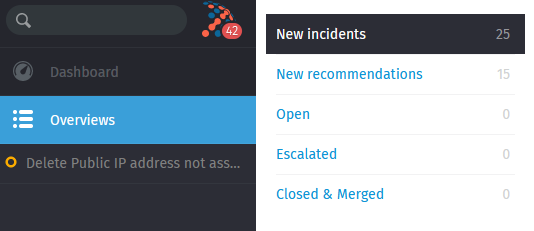

# VIAcode ITSM connector for Azure user guide

<!-- TOC -->

<!-- TOC END -->

## Overview

This guide is based on a version of the ITSM Connector for Azure **1.1**. 

Thank you for choosing VIAcode ITSM connector for Azure. ITSM connector helps you keep under control different types of Azure signals in one single ITSM ticketing system. 

This document will help you start using the connector to monitor and track issues with your resources and services in Azure using ITSM ticketing system VIMS. 

Here you can see an overview table of all supported features in VIAcode ITSM connector for Azure. 

**Table 1** 

| Supported integrations          | Backward synchronization | Detection time                                               | Prerequisite                   | Supported ITSM tool | Options                                                      |
| ------------------------------- | ------------------------ | ------------------------------------------------------------ | ------------------------------ | ------------------- | ------------------------------------------------------------ |
| Azure Monitor Alerts            | yes                      | All signals since connector installation                     |                                | VIMS                |                                                              |
| Budget Alerts                   | no                       | All alerts in subscription with "Active" state               |                                | VIMS                |                                                              |
| Security Center Alerts          | yes                      | All active  Security Center Alerts since connector installation | Azure Defender must be enabled | VIMS                | It is possible sync prior created active alerts with [Sync Azure signals]  option |
| Advisor Recommendations         | no                       | All new and updated Recommendations since connection installation |                                | VIMS                | It is possible sync prior created recommendations with [Sync Azure signals]  option |
| Security Center Recommendations | no                       | All new and updated Recommendations since connection installation |                                | VIMS                |                                                              |

## VIMS 

ITSM ticketing system VIMS (VIAcode Incident Management system) simplifies engineering effort on managing Azure signals by collecting different Azure issues in one single place. 

### Groups of signals

 By default, ticket on new active alerts (from Azure Monitor, Security Alerts, Budget Alerts)  will be created in "New incidents" group.   Notifications from Active Azure Advisor recommendations appear in "New recommendations" group. 

### ?New incidents group

"New incidents"

### ?New recommendations group

###  Managing different subscriptions

One ITSM connector allows to monitor one subscription in VIMS.  

It is possible to monitor several subscriptions with same ITSM tool VIMS. For this, you need to install connector to each subscription and specify FQDN of same  ITSM ticketing system.

## ?Azure Monitor Alerts

#### Introduction

Azure Monitor Alerts (Metric, Log Analytics, Activity log etc.) will be automatically created in your ticketing system with detailed information about incidents since connector installation to the subscription. 

#### Use Case: Detect active Azure Metric Alert 

#####  Backward sync 

#### Use Case.  Generate Azure Activity Log  Alert and get it in VIMS

### 

## ? Azure Cost Management Alerts
#### Introduction
##### Options 
- Only new created alerts detected
- 
#### Budget alert detection

## Azure Advisor recommendations
### Introduction

Azure Advisor is a personalized cloud consultant that helps you follow best practices to optimize your Azure deployments. The recommendations divided into five categories: Reliability, Security, Performance, Operational Excellence, Cost. 

Azure Advisor recommendations will be automatically created in your ticketing system with detailed information about resources and recommended actions. By default, connector creates tickets in ITSM tool for new recommendations or recently updated recommendations with new resources (recommendations that have been  updated at a time after connector installation to the subscription).  

Prior created recommendations in Azure can be retrieved to system using [Sync Azure signals] button.  

### Recommendation detection

Once new recommendation appeared in Azure Advisor it will be automatically detected by the ITSM connector, and a new ticket will be created in "New recommendations" group for the ITSM tool VIMS.

Here you can see ticket for active cost recommendation in Azure Advisor. Ticket contains recommendation name, link to affected resource and subscription id. Link [View in Azure portal] opens recommendation in Azure portal for the authenticated user. 

 

### Repeat count

Advisor recommendation can be applied to multiple resources.

For each new impacted resource ITSM tool VIMS calculates number of the affected resources increasing  "Repeat count"  setting by one. Each new impacted resource will appear in a new ***article*** for the existing recommendation with a link to it on Azure portal. 

## Azure Security Center alerts 
### Introduction

ITSM connector supports Security Center threat protection capability. This means that any active threat protection alert in your Azure subscription will be detected and displayed as a ticket in the ITSM system. 

#### Prerequisites

To get started with Security Center alerts notification in your ITSM system [ **Azure Defender** ](https://docs.microsoft.com/en-us/azure/security-center/security-center-pricing#free-option-vs-azure-defender-enabled) feature  should be enabled in Azure.

### Security alert detection 

Each new created security alert in Azure portal will be automatically detected by the ITSM connector, and a new ticket will be created in "New incidents" group for the ITSM tool VIMS. 

Here you can see ticket for active Security alert. Ticket contains alert name, link to affected resource, subscription id and  alert details. [View in Azure portal] opens resource in Azure Portal for the authenticated user. 

### Repeat count 

"Repeat count" setting for security alerts will indicate the number of alert repeats for the same resource.

## Features

### Sync Azure signals

The [Sync Azure signals] button allows you obtain active Security Alerts and Advisor recommendations created in your subscription prior ITSM connector installation.

To get prior incidents and recommendations in your ITSM tool perform the following steps: 

**Step1**

Go to Resource Group where the Managed Application installed (application named "VIAcode-ITSM-connector-for-Azure"). 

**Step2**

Open the  managed application named "VIAcode-ITSM-connector-for-Azure"

**Step3**

Click [Sync Azure signals] button 

**Step4**

Select types of signals to retrieve and click [Review+submit ] in Azure

### Backward synchronization

Backward synchronization capability in ITSM Connector allows to close Azure signals right from the ITSM system without necessity go to Azure portal. 

Backward synchronization option requires "Contributor" permissions for ITSM Connector to subscription. To check if you have Contributor permissions to Azure follow the [Configuration Guide](https://github.com/VIAcode/VIAcode-ITSM-connector-for-Azure/blob/main/VIAcode-ITSM-connector-for-Azure-deployment-and-configuration-guide.md#how-to-setup). 

To see integrations that support backward synchronization follow the Overview section in 

#### 

## ?Known limitations

### ?How many subscriptions does ITSM connector support? 

**Answer:** 

[https://docs.microsoft.com/en-us/azure/security-center/security-center-pricing#free-option-vs-azure-defender-enabled]: 

### Links

To gain better productivity and effectiveness working with Azure VIAcode provides additional services and tools that can be found by the following links.  

* [VIMS](https://azuremarketplace.microsoft.com/en-us/marketplace/apps/viacode_consulting-1089577.viacode-itsm-z) - VIAcode Incident Management System for Azure. Powerful system that creates a process around alerts, recommendations and threats in order to foster individual and organizational accountability.
* [VIAcode Azure DevOps](https://azuremarketplace.microsoft.com/en-us/marketplace/apps/viacode_consulting-1089577.vims-azuredevops)  - Azure DevOps connector for VIAcode IMS (VIMS).  The Azure DevOps Connector for VIAcode IMS integrates VIAcode Incident  Management System (VIMS) with Azure DevOps to enabling end-to-end SRE  escalation process for your Azure operations.

### ?Contact us

